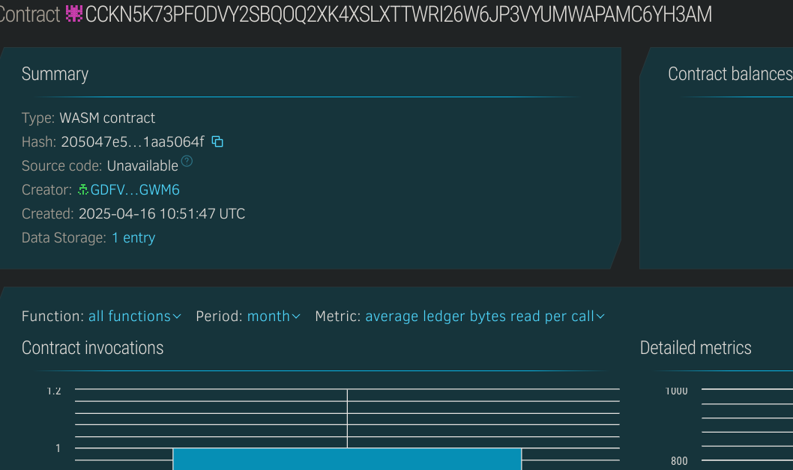

# Gas Tracker App

## Project Title
Gas Tracker: A Decentralized Gas Price Tracking System on Stellar

## Project Description
Gas Tracker is a blockchain-based application built on the Stellar network using Soroban smart contracts. It enables real-time tracking and verification of gas prices across different locations. The system allows trusted providers to submit gas price data, which is then securely stored on the blockchain and made available to users, helping them find the best gas prices in their vicinity.

## Project Vision
In a world where fuel costs significantly impact both individuals and businesses, transparency and accessibility to accurate gas price information is crucial. Gas Tracker aims to revolutionize how people interact with gas price data by leveraging blockchain technology to ensure data integrity, transparency, and accessibility.

Our vision is to create a decentralized ecosystem where:
1. Users can access reliable, up-to-date gas price information
2. Trusted providers can contribute verified price data
3. The entire system operates with minimal overhead and maximum efficiency
4. Information asymmetry in the fuel market is reduced, benefiting consumers

## Key Features

### Current Features
1. **Decentralized Price Tracking**
   * Gas prices stored immutably on the Stellar blockchain
   * Transparent history of price changes over time

2. **Multi-Provider Support**
   * Multiple trusted entities can submit price updates
   * Provider reputation system ensures data quality

3. **Location-Based Data**
   * Gas prices organized by location identifiers
   * Easy lookup of prices in specific areas

4. **Smart Contract Core**
   * Built on Soroban smart contracts for the Stellar network
   * Efficient storage and retrieval of price data

### Smart Contract Functions
* `update_gas_price`: Allows trusted providers to update gas prices for a specific location
* `get_gas_price`: Retrieves the latest gas price information for a given location
* `get_providers`: Returns a list of all registered price providers
* `get_update_count`: Tracks the total number of price updates submitted to the system

## Future Scope

### Planned Features
1. **Enhanced Provider Verification**
   * Implementation of a robust identity verification system for providers
   * Staking mechanism to ensure provider accountability

2. **Advanced Analytics**
   * Price trend analysis and forecasting
   * Historical price charts and statistical reporting

3. **User Interface Development**
   * Mobile application for easy access to gas price data
   * Interactive maps showing gas prices across different locations

4. **Integration Capabilities**
   * API for third-party applications to access gas price data
   * Integration with navigation systems and ride-sharing applications

5. **Incentive Mechanisms**
   * Reward system for accurate and timely price updates
   * Community validation of price submissions

6. **Cross-Chain Compatibility**
   * Expansion to other blockchain networks
   * Cross-chain data verification and synchronization

## Contract Details
CCKN5K73PFODVY2SBQOQ2XK4XSLXTTWRI26W6JP3VYUMWAPAMC6YH3AM
